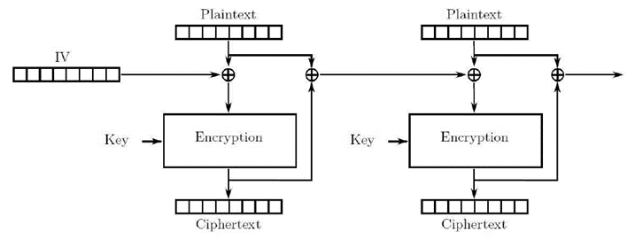

#                                                                                                                                                                                                                                                                                                                                                                                                                                                                                                                                                                                                                                                                                                                                                                                                                                                                                                                                                                                                                                                                                                                                                                                                                                                                                                                                                                                                                                                                                                                                                                                                                                                                                                                                                                                                                密码学基础-作业2

> 提交截止时间：2022年10月14日01：00；  提交方式：通过HITsz Grade平台提交
> 
> 提交格式：pdf文件              文件命名规则：【学号\_姓名\_作业2.pdf】
> 
> 注：如包含照片或插图，请旋转至适合阅读的方向

## 第1题

*考虑如下的分组密码：使用移位密码（shift cipher）作为分组密码，其输入输出都为4比特。令移位密码的秘钥$k$为3，需要加密的明文P为IAMFINE。下表给出了字母和对应4-比特二进制串的转换方法（注意本题字母表只有16个字母，而非26个。因此，示例：当秘钥$k=3$时，$E_k(P)=C$)。请使用分组密码的CBC模式对明文P进行加密，设初始向量$IV=0101$，给出具体加密步骤以及最终加密结果。*

| *A*    | *B*    | *C*    | *D*    | *E*    | *F*    | *G*    | *H*    |
| ------ | ------ | ------ | ------ | ------ | ------ | ------ | ------ |
| *0000* | *0001* | *0010* | *0011* | *0100* | *0101* | *0110* | *0111* |

| *I*    | *J*    | *K*    | *L*    | *M*    | *N*    | *O*    | *P*    |
| ------ | ------ | ------ | ------ | ------ | ------ | ------ | ------ |
| *1000* | *1001* | *1010* | *1011* | *1100* | *1101* | *1110* | *1111* |

加密步骤：

1. 第一个明文分组与初始向量异或再加密

   $C_1=E_k(P_1\oplus IV)=E_3(1000\oplus0101)=E_3(1101)=0000$

2. 其余明文分组依次与前一个密文分组异或再加密

   1. 计算第二组密文

      $C_2=E_k(P_2\oplus C_1)=E_3(0000\oplus0000)=E_3(0000)=0011$

   2. 计算第三组密文

      $C_3=E_k(P_3\oplus C_2)=E_3(1100\oplus0011)=E_3(1111)=0010$

   3. 计算第四组密文

      $C_4=E_k(P_4\oplus C_3)=E_3(0101\oplus0010)=E_3(0111)=1010$

   4. 计算第五组密文

      $C_5=E_k(P_5\oplus C_4)=E_3(1000\oplus1010)=E_3(0010)=0101$

   5. 计算第六组密文

      $C_6=E_k(P_6\oplus C_5)=E_3(1101\oplus0101)=E_3(1000)=1011$

   6. 计算第七组密文

      $C_7=E_k(P_7\oplus C_6)=E_3(0100\oplus1011)=E_3(1111)=0010$

3. 得到最终加密结果：$0000001100101010010110110010$

最终加密结果：$ADCKFLC$

## 第2题

*考虑如下分组加密操作模式，并回答以下问题：*

*（1） 请画图说明密文的解密过程。（所画图中应至少包含两个分组）*

*（2）请利用如下符号：$C_N,P_N,C_{N-1},P_{N-1},E_K(\cdot)$（密钥$K$下的分组加密操作）和$D_K(\cdot)$（密钥$K$下的分组解密操作），根据图示写出加密与解密的公式。*

​			*例如，在课件中CBC的对应公式如下：*
$$
C_N=E_K(C_{N-1}\oplus P_N)~~~~~~~~~~~~~~C_0=IV\\
P_N=C_{N-1}\oplus D_K(C_N)~~~~~~~~~~~~~~C_0=IV
$$
​			*请按照同样的格式给出上述加密与解密的对应公式。*

*（3）假设一个密文分组被更改/损坏（由于噪声或恶意破坏）。 这将如何影响解密？ 解密后会影响多少个明文分组？*

> 记得删除我：先写（2）的公式，再画（1）；（3）要根据公式和图仔细分析，有难度

（1）：

解密过程示意图为：

（2）：

- 加密对应的公式为：
- 解密对应的公式为：

（3）：

## 第3题

*现有一个系统采用流密码加密其传输的数据*

*（1）假设使用密钥流 $0x1234$ 来加密明文数据 $0xABCD$（所有数字都是十六进制数）。请写出加密后的密文，用十六进制表示。*

*（2）假设有一个敌手能够窃听传输的消息，但他不知道明文和密钥流。现在他想通过篡改密文的方式改变消息，使得接收者解密之后的明文为 $0xA5CD$ ，请问他如何做到？*

> 记得删除我：（1）应该就是异或一下，（2）就是已知一个密文，求一个明文对应的密文，应该要设出原明文和密钥流，列出流密码的两个公式，尝试化简解方程

（1）：

（2）：

## 第4题

*设一个5级线性反馈移位寄存器（LFSR）的特征多项式为 $f(x)=1+x^2+x^4$。*

*（1） 画出该LFSR的框图；*

*（2） 给出输出序列的递推关系；*

*（3）设初始状态 $(a_1,a_2,a_3,a_4,a_5)=(1,0,0,1,1)$ ，写出输出序列。*

> 记得删除我：很简单

（1）：

（2）：

（3）：
