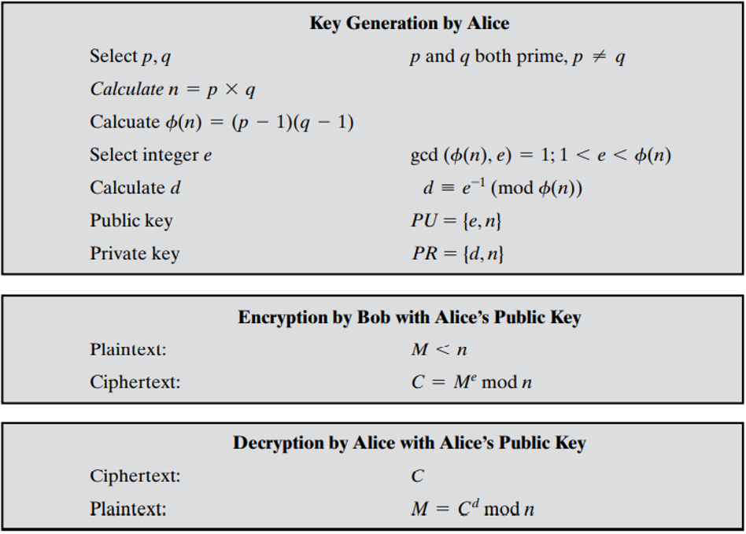

# 密码学基础-作业3

提交方式：通过HITsz Grade平台提交   提交截止时间：以系统上公布时间为准   

提交格式：pdf文件             文件命名规则：学号\_姓名_作业3.pdf

注：若包含照片或插图，请旋转至适合阅读的方向

 

1. 求：$gcd(24140,16762)$

   解：使用欧几里得算法
   $$
   24140=1\times16762+7378\\
   16762=2\times7378+2006\\
   7378=3\times2006+1360\\
   2006=1\times1360+646\\
   1360=2\times646+68\\
   646=9\times646+34\\
   68=2\times34\\
   $$
   所以$gcd(24140,16762)=34$

   

2. 用扩展欧几里得算法求下列乘法逆元：$1234~mod~4321$

   解：使用欧几里得算法求$gcd(1234,4321)$：
   $$
   4321=3\times1234+619\\
   1234=1\times619+615\\
   619=1\times615+4\\
   615=153\times4+3\\
   4=1\times3+1\\
   3=3\times1
   $$
   由扩展欧几里得算法得：
   $$
   \begin{align}
   1&=4-1\times3\\
   &=4-1\times(615-153\times4)\\
   &=-615+154\times4\\
   &=-615+154\times(619-1\times615)\\
   &=154\times619-155\times615\\
   &=154\times619-155\times(1234-1\times619)\\
   &=-155\times1234+309\times619\\
   &=-155\times1234+309\times(4321-3\times1234)\\
   &=-1082\times1234+309\times4321\\
   \end{align}
   $$
   所以有$(-1082\times1234+309\times4321)~mod~4321=1~mod~4321$，

   即$(-1082\times1234)~mod~4321=1$

   所以逆元为$-1082$

   

3. 用费马小定理计算：$3^{201}~mod~11$

   解：

   由费马小定理，因为$11$是素数，所以有$3^{11}\equiv3(mod~11)$

   由同余的可乘性得：$3^{11}\times3^{190}\equiv3\times3^{190}(mod~11)$

   即$3^{201}\equiv3^{191}(mod~11)$

   同理可得：
   $$
   3^{191}\equiv3^{181}(mod~11)\\
   3^{181}\equiv3^{171}(mod~11)\\
   ....\\
   3^{11}\equiv3^{1}(mod~11)\\
   $$
   所以由同余的传递性可得：$3^{201}~mod~11=3~mod~11=3$

   

4. 用费马小定理找到一个位于0到28之间的数$x$，使得$x^{85}$模29与6同余（不使用穷举法）。

   解：依题意，需要计算出$x$满足如下条件：
   $$
   0<x<28\\
   x^{85}\equiv6(mod~29)
   $$
   由费马小定理，因为$29$是素数，所以有$6^{29}\equiv6(mod~29)$

   由同余的可乘性得：$6^{57}\equiv6^{29}(mod~29)$

   同理可得：$6^{85}\equiv6^{57}(mod~29)$

   由同余的传递性可得：$6^{85}\equiv6(mod~29)$

   依题意，只需只找到$x$满足$x^{85}\equiv6^{85}(mod~29),0<x<28$

   显然，$x=6$

   

5. 用欧拉定理找到一个位于0到9之间的数$a$，使得$7^{1000}$模10与$a$同余（注意这等同于$7^{1000}$的十进制数展开的最后一位）。

   解：依题意，需要计算出$a$满足如下条件：
   $$
   0<a<9\\
   7^{1000}\equiv a(mod~10)
   $$
   由欧拉定理，因为$(7,10)=1$，所以有$7^{\phi(10)}\equiv1(mod~10)$

   又因为$\phi(10)=4$，所以$7^4\equiv1(mod~10)$

   由同余的可乘性，得：$7^8\equiv7^4(mod~10)$

   同理可得：

   $7^{12}\equiv7^{8}(mod~10)$

   $7^{16}\equiv7^{12}(mod~10)$

   $...$

   $7^{1000}\equiv7^{996}(mod~10)$

   由同余的传递性得：$7^{1000}\equiv1(mod~10)$

   显然，$a=1$

   

6. 下面是孙子用来说明CRT的一个例子，请求解x。

   $x\equiv2(mod~3);~~~~x\equiv3(mod~5);~~~~x\equiv2(mod~7)$

   解：

   $m_1=3~~~~m_2=5~~~~m_3=7$

   $a_1=2~~~~a_2=3~~~~a_3=2$

   $M=m_1m_2m_3=3*5*7$

   $M_1=M/m_1=35$

   $M_2=M/m_2=21$

   $M_3=M/m_3=15$

   令$M_1e_1\equiv1(mod~m_1)$，可解得$e_1=2$

   令$M_2e_2\equiv1(mod~m_2)$，可解得$e_2=1$

   令$M_3e_3\equiv1(mod~m_3)$，可解得$e_3=1$

   则$x\equiv (M_1e_1a_1+M_2e_2a_2+M_3e_3a_3)(mod~M)\equiv233(mod~M)$

   

7. 给定29的本原根2，构造离散对数表，并利用该表解下列同余方程：
    $$
    a.~17x^2\equiv10(mod~29)\\
    b.~x^2-4x-16\equiv0(mod~29)\\
    c.~x^7\equiv17(mod~29)\\
    $$
    解：依题意，设$b\equiv2^imod~29$

    则离散对数表为：

    |  i   |  b   |
    | :--: | :--: |
    |  1   |  2   |
    |  2   |  4   |
    |  3   |  8   |
    |  4   |  16  |
    |  5   |  3   |
    |  6   |  6   |
    |  7   |  12  |
    |  8   |  24  |
    |  9   |  19  |
    |  10  |  9   |
    |  11  |  18  |
    |  12  |  7   |
    |  13  |  14  |
    |  14  |  28  |
    |  15  |  27  |
    |  16  |  25  |
    |  17  |  21  |
    |  18  |  13  |
    |  19  |  26  |
    |  20  |  23  |
    |  21  |  17  |
    |  22  |  5   |
    |  23  |  10  |
    |  24  |  20  |
    |  25  |  11  |
    |  26  |  22  |
    |  27  |  15  |
    |  28  |  1   |

    解方程$a$：
    $$
    17x^2\equiv10(mod~29)\\
    \Lrarr2^{21}x^2\equiv2^{23}(mod~29)\\
    \Lrarr x^2\equiv4(mod~29)\\
    \Lrarr x\equiv\pm2(mod~29)\\
    \Lrarr x\equiv2,27(mod~29)\\
    $$

    解方程$b$：
    $$
    x^2-4x-16\equiv0(mod~29)\\
    \Lrarr x^2-4x+4\equiv20(mod~29)\\
    \Lrarr (x-2)^2\equiv2^{24}(mod~29)\\
    \Lrarr x-2\equiv\pm2^{12}(mod~29)\\
    \Lrarr x-2\equiv\pm7(mod~29)\\
    \Lrarr x\equiv9,-5(mod~29)\\
    \Lrarr x\equiv9,24(mod~29)\\
    $$
    解方程$c$：
    $$
    x^7\equiv17(mod~29)\\
    \Lrarr2^{28}x^7\equiv2^{21}(mod~29)\\
    \Lrarr2^{7}x^7\equiv1(mod~29)\\
    \Lrarr2x\equiv2^{28}(mod~29)\\
    \Lrarr x\equiv2^{27}(mod~29)\\
    $$
    

8. 用下图所示的RSA算法对以下数据实现加密和解密：

    $p=5,~~~~q=11,~~~~e=3,~~~~M=9$

    

    解：

    1.   密钥生成：
         $$
         n=p\times q=5\times11=55\\
         \phi(n)=(p-1)\times(q-1)=4\times10=40\\
         $$
         令$gcd(\phi(n),e)=1$，即$gcd(40,e)=1$，依题意选择$e=3$
         
         令$d\equiv e^{-1}(mod~\phi(n))\equiv 3^{-1}(mod~40)$
         
         使用扩展欧几里得算法求解得：$d=27$
         
         所以：
         
         -   公钥为：$PU=\{e,n\}=\{3,55\}$
         -   私钥为：$PU=\{d,n\}=\{27,55\}$
         
    2.   加密：

         明文$M=9<55=n$

         则密文$C=M^e~mod~n=9^3~mod~55=14$

    3.   解密：

         解密后的明文为$M=C^d~mod~n=14^{27}~mod~55=9$

         

9. 在RSA公钥密码体制中，每个用户都有一个公钥e和一个私钥d。假定Bob的私钥已泄密。Bob决定生成新的公钥和私钥，而不生成新的模数，请问这样做安全吗？

    解：由密钥生成过程可知：

    $ed\equiv1~mod~\phi(n)$

    所以有$\phi(n)=\frac{ed-1}k,k=1,2,...$

    且$gcd(\phi(n),e)=1$

    据此可以求出有限个可能的$\phi(n)$和可能的$e$，从而得到所有可能的密钥$d$

    所以这样做不安全

    

10. 本题说明选择密文攻击的简单应用。Bob截获了一份发给Alice的密文C，该密文是用Alice的公钥e加密的。Bob想获得原始消息$M=C^d~mod~n$。Bob选择一个小于n的随机数r，并计算$Z=r^e~mod~n$，$X=ZC~mod~n$，$t=r^{-1}~mod~n$。接着，Bob让Alice用她的私钥对X进行认证（见图9.3），从而解密X。Alice返回$Y=X^d~mod~n$。说明Bob如何利用获得的信息求M。

    解：
    $$
    \begin{align}
    Y&=X^d~mod~n\\
    &=(ZC)^d~mod~n\\
    &=(ZC)^d~mod~n\\
    &=(Z^d~mod~n)\times (C^d~mod~n)\\
    &=(r^{ed}~mod~n)\times (C^d~mod~n)\\
    &=((r^e~mod~n)^d~mod~n)\times (C^d~mod~n)\\
    &=rM\\
    \end{align}
    $$
    所以$t(Y~mod~n)=t(rM~mod~n)=t(r~mod~n)M=M$

    即$M=tY~mod~n$

    

     

     

     

     

     

 