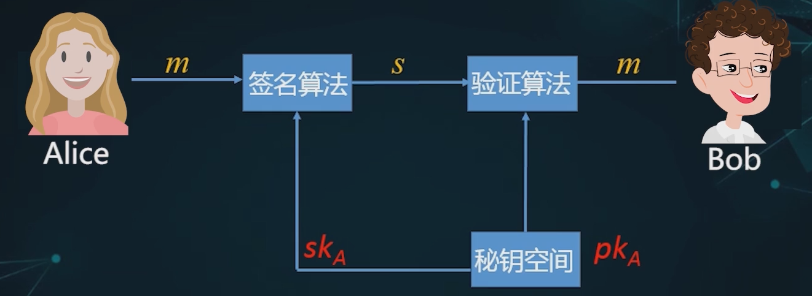
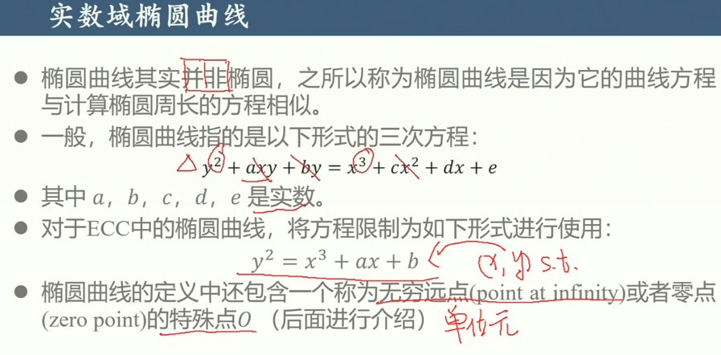

# 公钥密码

## 概述

### 1 背景与提出

关于密钥的疑问：

公钥密码的提出：

密钥分配问题：

密钥管理问题：

**数字签名**问题：

> 上图下，Bob也可以制作同样的密文，其他人可以质疑说这个密文不是Alice发的，而是Bob自己弄的，这样Bob也没有明确的有力证据去反驳

### 2 基本思想与原理

*为用户产生**一对密钥**：*

- 公钥
- 私钥

---

*加密原理：*

- ==公钥加密、私钥解密==
- ==私钥数字签名、公钥验证==

要满足的要求：

- 单向函数：

  

- 陷门单向函数：

  

  - 陷门t就对应了用户的私钥

  - 要借助数学上的困难问题构造陷门单向函数

    

### 3 公钥密码与对称密码对比

- 所以公钥密码体制是对称密码体制的补充，并不能完全取代对称密码

## RSA算法

> **大整数因数分解问题**构造的算法

> 下面主要介绍的是RSA用于加密，当然RSA还可以应用在**数字签名**上

### 1 密钥生成

- 攻击者如果想求出私钥d，就需要求出$\phi(n)$，而只知道n，求$\phi(n)$是困难的
- 逆元可以用欧几里德算法求出

### 2 加密与解密

- 注意每个分组要小于n，n就是两个大素数相乘得到的

### 3 举例

密钥生成：

加密：

- 保证m~x~小于n

解密：

### 4 RSA算法的实质

密文以一一对应的方式体现明文信息，这一点其实不太好

### 5 RSA算法的安全性

## Rabin算法

>   破解RSA算法的关键：
>
>   

### 1 概述

可证明安全性

改进：

==本质：基于**大整数因数分解**（IF）困难问题构造的又一种陷门单向函数==

### 2 算法描述

#### 2.1 密钥生成

#### 2.2 加密变换

与RSA类似，只不过**加密指数是2**

>   

#### 2.3 解密变换

求解同余方程组

求解素数模下的平方根在多项式时间内是有解的

>   

确定明文：

### 3 举例

## DH密钥交换

### 1 概述、定义

在交互过程（密钥协商）中产生密钥：

更对等、更公平

定义：

>   

### 2 思想描述

产生Key需要三样东西，其中secret是攻击者无法拥有的，secret也是不会在公开信道上直接传递的（会混合传递）

### 3 原理/工作流程

-   $Z_q$是1到q-1中的整数

-   **==本质是离散对数困难问题（DLP问题）==**

    >   

>   

### 4 安全性

被动攻击有DLP作保障，没有问题

主动攻击-伪装攻击：Carol假装是Bob，**给Alice提供自己的y**

-   但这种攻击一般只能成功一次，因为Bob会发现问题

-   这就需要**身份认证**了 

    >   只有加密算法是不够的

主动攻击-中间人攻击：一边给自己的g^x^一边给自己的g^y^

>   在很精密的系统中，可以通过**时间延迟**去发现问题

## ElGamal加密

### 1 概述

公钥每次加密时都随机变

基于DLP困难问题

### 2 算法步骤

- 体会加密时的随机性

  > 两次计算密文，会降低效率

- 解密的重点是求K

## 椭圆曲线密码学

基于ECDLP困难问题

### 1 概述

需要同样安全但更高效的算法

### 2 数学基础

群和交换群：

> 在这个情景下，群中的元素是点
>
> 

群的运算：

#### 2.1 实数域上的椭圆曲线

ECC中的椭圆曲线：

- 满足等式的点
- 又加上了一个无穷远点，想让它做单位元

<u>ECC群的正式定义</u>：

- 群性质、加法的描述：

  

  

  > 注意这个加法的特殊性

- 加法计算公式：

  

#### 2.2 有限域Zp上的椭圆曲线

正式定义：

- 重点：$E_p(a,b)$

群的运算（加法）：

- 这里的除法其实就是乘法逆，也就是和谁乘了之后模p为1

> 举例：
>
> 

椭圆曲线上的DLP问题：（**ECDLP**）

### 3 椭圆曲线密码体制下的DH密钥交换

> 与DLP问题下的DH密钥交换很像

> 当然，这个公共的G也要在信道上传输

### 4 椭圆曲线密码体制下的EIGamal加密

> ECC加密

> 总结：
>
> 

