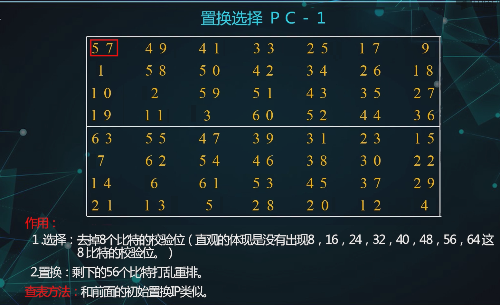
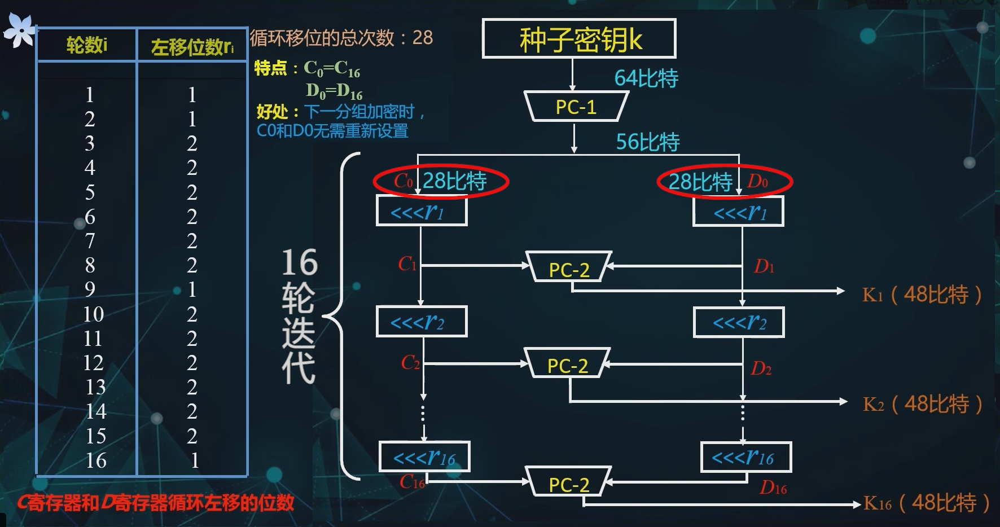
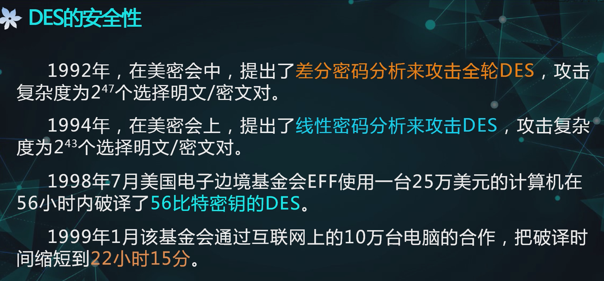

# 分组密码

## 1 概述

### 1.1 概念

> block cipher

分组密码是**对称密码**的一种

> 对称密码就是加密密钥和解密密钥相同，或者二者之间很容易互相推出

> 

> 

### 1.2 数学表达

- 要**一一映射**才能解密

分组密码的两个函数：

### 1.3 要求与原则

> Shanno提出的

安全性原则：

> 混淆就是让依赖变得复杂，通过统计、代数等手段无法直接弄清这种关系

实现性原则：

### 1.4 迭代分组密码

> 

轮函数的作用：

> 举例：
>
> 
>
> 

## 2 DES

### 2.1 概述

#### 2.1.1 背景

> 

#### 2.1.2 基本原理

> 密钥有8bit的奇偶校验

### 2.2 加密流程

#### 2.2.1 初始置换IP

#### 2.2.2 初始逆置换

> 

> 
>
> 那为什么要包含呢？不知道，设计者没有解释

#### 2.2.3 16轮迭代

- 前15轮都相同，第16轮有所不同

前15轮：

第16轮：

> 这样做的目的是达成加密和解密的一致，在实现时节省资源

评价：

#### 2.2.4 轮函数F

轮函数F用来实现扩散和混淆，是DES的核心

轮函数的构成：

##### 2.2.4.1 扩展置换E

> 作用：
>
> 

用表来描述：

##### 2.4.4.2 轮密钥加

就是个异或

##### 2.2.4.3 S盒

> 

以S~6~为例讲解：

> S盒的设计准则：
>
> 
>
> > **S盒是DES中唯一的非线性变换，起到<u>混淆</u>作用**

##### 2.2.4.5 置换P

较好的扩散性：

### 2.3 密钥扩展方案

> 
>
> 如何用64bit密钥生成迭代中要用到的48*16bit密钥呢

密钥扩展过程：先PC-1，再分组若干次左移后接PC-2

#### 2.3.1 置换选择PC-1

PC-1表的形成机制：先一列一列从右往左写，然后去掉最后一行8个校验位，再从两头向中间读

#### 2.3.2 循环左移

#### 2.3.3 置换选择PC-2

去掉了 9 18 22 25 35 38 43 54

### 2.4 解密流程

不同点：

### 2.5 DES的安全性

### 2.6 实例 

一个分组的DES加密示例：

 

 1. 密钥扩展方案

    

    1. 置换选择PC-1

       

    2. 16轮迭代

       

       

 2. 加密流程

    1. 初始置换IP

       

    2. 16轮迭代

       

       1. 扩展置换E

          

       2. 轮密钥加

          

       3. S盒：混淆

          

       4. 置换P：扩展

          

       

       

    3. 初始逆置换IP^-1^

       

    

