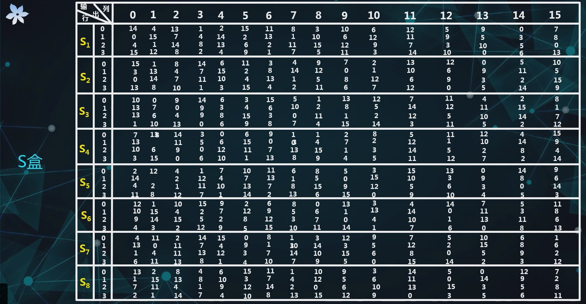
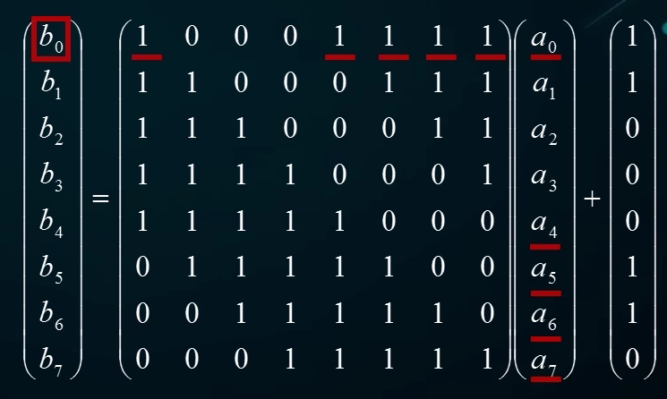
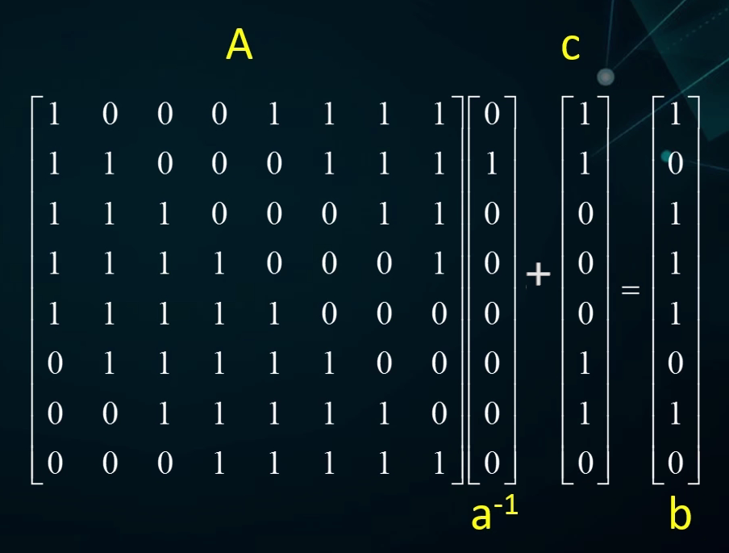
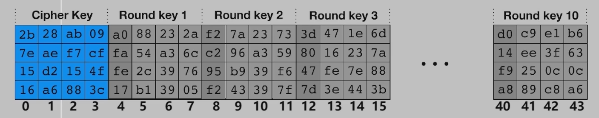
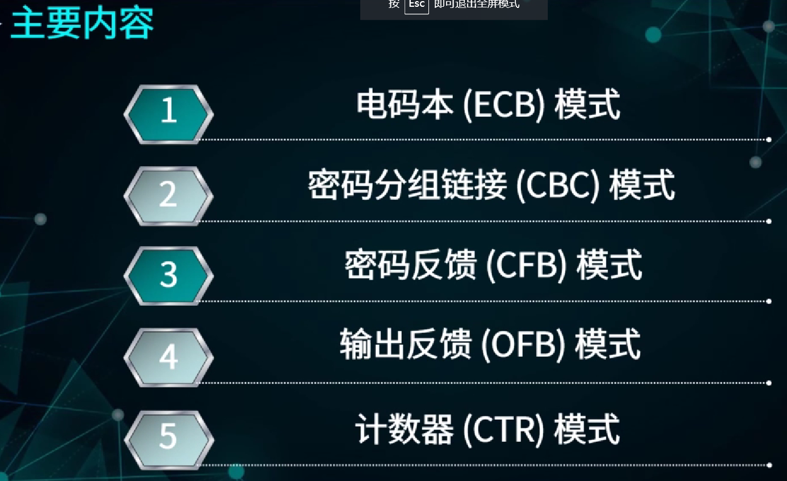
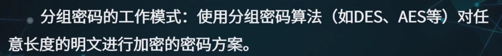
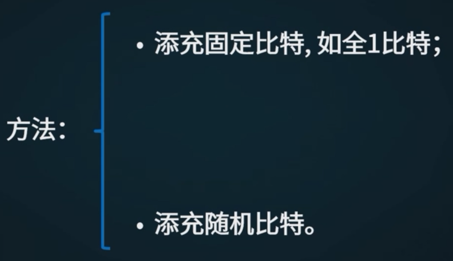
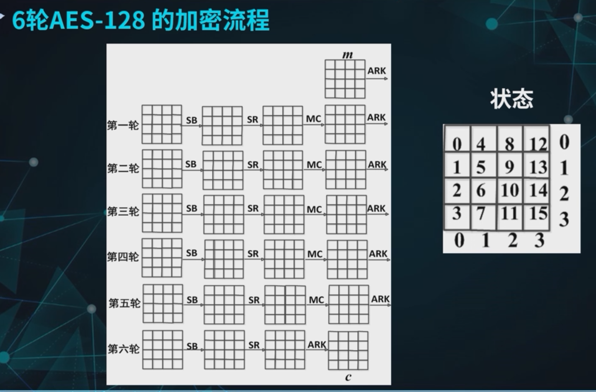

# 分组密码

## 1 概述

### 1.1 概念

> block cipher

分组密码是**对称密码**的一种

> 对称密码就是加密密钥和解密密钥相同，或者二者之间很容易互相推出

> 

> 

### 1.2 数学表达

- 要**一一映射**才能解密

分组密码的两个函数：

### 1.3 要求与原则

> Shanno提出的

安全性原则：

> 混淆就是让依赖变得复杂，通过统计、代数等手段无法直接弄清这种关系

实现性原则：

### 1.4 迭代分组密码

> 

轮函数的作用：

> 举例：
>
> 
>
> 

## 2 DES

### 2.1 概述

#### 2.1.1 背景

> 

#### 2.1.2 基本原理

> 密钥有8bit的奇偶校验

### 2.2 加密流程

#### 2.2.1 初始置换IP

#### 2.2.2 初始逆置换

> 

> 
>
> 那为什么要包含呢？不知道，设计者没有解释

#### 2.2.3 16轮迭代

- 前15轮都相同，第16轮有所不同

前15轮：

第16轮：

> 这样做的目的是达成加密和解密的一致，在实现时节省资源

评价：

#### 2.2.4 轮函数F

轮函数F用来实现扩散和混淆，是DES的核心

轮函数的构成：

##### 2.2.4.1 扩展置换E

> 作用：
>
> 

用表来描述：

##### 2.4.4.2 轮密钥加

就是个异或

##### 2.2.4.3 S盒

> 

以S~6~为例讲解：

> S盒的设计准则：
>
> 
>
> > **S盒是DES中唯一的非线性变换，起到<u>混淆</u>作用**

##### 2.2.4.5 置换P

较好的扩散性：

### 2.3 密钥扩展方案

> 
>
> 如何用64bit密钥生成迭代中要用到的48*16bit密钥呢

密钥扩展过程：先PC-1，再分组若干次左移后接PC-2

#### 2.3.1 置换选择PC-1

PC-1表的形成机制：先一列一列从右往左写，然后去掉最后一行8个校验位，再从两头向中间读

#### 2.3.2 循环左移

#### 2.3.3 置换选择PC-2

去掉了 9 18 22 25 35 38 43 54

### 2.4 解密流程

不同点：

### 2.5 DES的安全性

### 2.6 实例 

一个分组的DES加密示例：

 

 1. 密钥扩展方案

    

    1. 置换选择PC-1

       

    2. 16轮迭代

       

       

 2. 加密流程

    1. 初始置换IP

       

    2. 16轮迭代

       

       1. 扩展置换E

          

       2. 轮密钥加

          

       3. S盒：混淆

          

       4. 置换P：扩展

          

       

       

    3. 初始逆置换IP^-1^

       

    

## 3 AES

### 3.1 概述

#### 3.1.1 背景

> DES的最大弱点就是密钥长度太短，只有56bit
>
> 三重DES：
>
> 
>
> 密钥长度变长了，但加密时间增加了

> 
>
> 

#### 3.1.2 基本原理

> 与Fesitle相比，SPN结构数据扩散更快

### 3.2 加密流程

> 这里首先有一个**和白化密钥异或**的过程；
>
> 第10轮省略列混合，为了使加密和解密过程更加接近

状态：

#### 3.2.1 数学基础

##### 3.2.1.1 字节的表示和运算

<u>构造</u>：

> b~i~为0或1

> 这个构造方法就是之前讲过的，用已知有限域上m次素多项式构造出来的

---

<u>加法与乘法</u>：

> 注意这里需要使用Euclid算法求逆元，AES中会用到。具体怎么算我也不知道，之后有机会再学吧

##### 3.2.1.2 字的表示与运算

> 求系数的话就是原系数下标之和模4等于对应幂数的：
>
> 
>
> 这里固定矩阵的思想下面AES中会再用一次；
>
> 这里的乘法和加法还需要使用**字节的加法和乘法规则**

#### 3.2.2 单轮加密变换

##### 3.2.2.1 字节代替

> 

S盒的代数规律：

- 非线性的特质由第一步运算体现
- 第二步在一定程序上起到扩散作用

> 矩阵每列都有5个1说明，改变输入中的1个bit，会影响输出的5个bit：
>
> 
>
> 矩阵每行都有5个1说明，每bit输出和输入中的5个bit相关：
>
> 

> 这种计算方法和刚才给出的表是一致的：
>
> 
>
> 

##### 3.2.2.2 行移位

> 但这样做完之后同一行的还是在同一行，需要进一步分散

##### 3.2.2.3 列混合

- 这就是直接对一个**字**进行运算了

> 

##### 3.2.2.4 轮密钥加

### 3.3 密钥扩展方案

> 

#### 3.3.1 第一阶段

---

存储方式：

> 用一个数组存储扩展密钥的每一列，每个元素是一个字

生成方法：

- 第一种情况

  

  > 那个g(w[i-1])后边的i-4要改成i-1

  > 

- 第二种情况：

  

#### 3.3.2 第二阶段

---

### 3.4 解密流程

---

AES加解密流程不同实现时需要加密器和解密器，但它们的结构相同

#### 3.4.1 逆字节代替

---

> 

数学描述：

#### 3.4.2 逆行移位

---

#### 3.4.3 逆列混合

---

#### 3.4.4 逆轮密钥加

---

### 3.5 安全性

> 其实最有效的方法就是穷举，但以目前计算机的能力，穷举要上亿年，所以目前AES是安全的

### 3.6 实例

#### 3.6.1 加密流程

---

##### 3.6.1.1 字节代替

> SubBytes

##### 3.6.1.2 行移位

> ShiftRows

##### 3.6.1.3 列混合

> MixColumns

##### 3.6.1.4 轮密钥加

> AddRoundKey

> 

#### 3.6.2 密钥扩展方案

##### 3.6.2.1 密钥扩展

> 
>
> 

##### 3.6.2.2 轮密钥选取

## 4 分组密码的工作模式

---

### 4.0 填充方式

#### 4.0.1 NoPadding

不填充，明文的字节长度只能是 16 的整数倍，一般不适用。

#### 4.0.2 Zeros

补 0，如果原数据字节长度恰好是 16 的倍数，也要补充多 16 个 0；

#### 4.0.2 ISO10126

最后一个字节是填充的字节数（包括最后一个字节自己），其他全部填随机数。

示例 1：`0123456789abc`，`0123456789abc` 共 13 个数据，长度差 3，则会填充两个随机数（比如为 `4` 和 `f`）然后加上长度 3，`0123456789abc4f3`

示例 2:`0123456789abcef0`，长度刚好是 16 的整数倍，那就会再增加一个分组，前面 15 个位随机数，后面一个为长度 `f`，可能为 `fe473564975fedgf`

#### 4.0.3 PKCS5 (PKCS7)

最后一组缺几个字节就填充几，如果刚好是 16 的整数倍，也要填充 16 个字节。

示例 1：`0123456789abc`共 13 个数据，再填充 3 个才够 16 个，PKCS7 填充时会在后面填充 3 个 3。填充后为`0123456789abc333`

示例 2： `0123456789abcef0`，长度刚好是 16 的整数倍，那就会再增加一个分组为`ffffffffffffffff`

---

> 
>
> 但实际应用中，要加密的明文长度是不确定的 

### 4.1 电码本(ECB)

---

> 

> 
>
> 
>
> 
>
> 

说明 

- Q: 最后一个分组是否需要填充？A: 是
- Q: 是否需要初始化向量？A: 否

### 4.2 密码分组链接(CBC)

> 这个后面也要补齐

- CBC模式的加密：将当前明文分组与前一个密文分组进行异或后在进行加密操作。第一个明文分组之前没有密文分组，需要将第一个明文分组与一个初始向量IV进行异或。
- CBC模式的解密：将当前密文分组解密操作，然后与前一个密文分组进行异或。
- CBC模式中的IV（初始向量）：
  - 随机数。每次加密前随机产生，使得相同的明文，加密后得到不同的密文。
  - 为了解密能够顺利进行，发送方和接受方都应该知道IV。
  - IV 无须保密，可以以明文形式传输
- CBC模式的特点：
  - 明文块的统计特性得到了隐蔽。由于在密文CBC模式中，各密文块不仅与当前明文块有关，而且还与以前的明文块及初始化向量有关，从而使明文的统计规律在密文中得到了较好的隐蔽。
  - 具有有限的(两步)错误传播特性。一个密文块的错误将导致两个密文块不能正确解密
  - 具有自同步功能。密文出现丢块和错块不影响后续密文块的脱密**.** 若从第**t**块起密文块正确**,**则第**t+1**个明文块就能正确求出。
- CBC模式的典型应用：
  - 数据加密;
  - 完整性认证和身份认证;

说明 

- Q: 最后一个分组是否需要填充？A: 是
- Q: 是否需要初始化向量？A: 是

### 4.3 密文反馈(CFB)

密文反馈模式（Cipher FeedBack, 简称 CFB）：在上面两个工作模式 ECB 和 CBC 中，整个数据分组需要在接收完之后才能进行加密。但是在一些网络应用中，需要即刻把一个终端输入的字符传给主机。这样上面的两种工作模式就不能满足。在 CFB 模式中，数据可以在比分组（8 bytes）小的单元里进行加密。其工作方式类似流密码。

CFB 模式中，假设传输的最小单元是 `s`（下图以 8bits 为例）位，分组大小为 `b` 位（AES 分组的大小是 128bits）。首先将初始化向量 `IV` 放到 `b` 位的移位寄存器中，加密函数输出最左边的 `s` 位，与明文分片 `P1` 进行异或，得到的密文 `C1` 并发送，然后把移位寄存器左移 `s` 位，把 `C1` 填入寄存器最右边的 `s` 位开始第二个明文分片的加密。具体如下图所示。

> 图中的明文是其实是明文分片，每一片只有s位

优点： 

- **1.**隐藏明文的数据格式。 
- **2.**每一次可以加密**j**比特明文块，因此灵活适应各种数据格式 的需求。比如，数据库加密要求加密时不能改变明文的字节长度，这时就要以明文字节长度为单位进行加密。 

缺点： 

- **1.**加解密效率低：一次只能完成 **j**个比特明密文数据的加解密。 
- **2.**会造成错误传播：因为**CFB**是自同步序列密码：密钥序列依赖于密文。所以，密文某个比特错误，解密后不仅可以导致在明文相同位置产生一个单比特错误；同时，只要这一密文错误还在移位寄存器中，就会造成相应密钥序列和明文序列的错误。 

应用：数据库加密等对数据格式有特殊要求的应用环境。 

说明 

- Q: 最后一个分组是否需要填充？A：否，类似流密码，不分组，因此不需要填充
- Q: 是否需要初始化向量？A：是

### 4.4 输出反馈(OFB)

输出反馈模式（Output FeedBack, 简称 OFB）：OFB 模式的结构跟上面 CFB 的模式很相似，不同的是它用加密函数的输出来填充移位寄存器，而 CFB 是用密文单元来填充移位寄存器。而且它是对整个分组来运算的。

优点： 

- １**.**不具有错误传播特性。因为**OFB**是同步 序列密码：密钥序列的产生独立于密文，所以， 密文某个比特错误，解密后仅会导致在明文相同 位置产生一个单比特错误。     
- ２**.**隐蔽明文的数据格式 。 

缺点：加解密效率低。 

应用：图像加密、语音加密。 

说明 

- Q:最后一个分组是否需要填充？A:否，如果最后分组只有 `u` 位，`u < b`( `b` 为分组长度)，那么会将最后输出最左边的 `u` 位与最后分组的 `u` 位做异或运算，其余的 `b-u` 位舍弃。
- Q:是否需要初始化向量？A:是

### 4.5 计数器(CTR)

计数器模式（Counter, 简称 CTR）：计数器模式使用与明文文组规模相同的长度，第一个明文分组与加密后的初始的计数器进行异或，后面随着消息块的增加计数器的值加 1。

优点： 

​    1.可并行 执行：因为计数器模式各块儿可单独处理。 

​    2.可预处理：明文不参与密钥产生。 

应用：随机存取数据的加密。 

说明 

- Q: 最后一个分组是否需要填充? A:否，如果最后分组只有 `u` 位，`u < b`(`b` 为分组长度)，那么会将最后输出最左边的 `u` 位与最后分组的 `u` 位做异或运算，其余的 `b-u` 位舍弃。
- Q: 是否需要初始化向量? A:是

## 5 6轮AES-128的不可能差分攻击

### 5.1 6轮AES-128的加密流程

> 下面将AES-128简称为AES

### 5.2 不可能差分攻击的思想

### 5.3 构造4轮AES不可能差分特征

> 右边给的是一个反证法

### 5.4 6轮AES的密钥恢复

先在4轮的基础上，前后分别扩展出一轮，密钥恢复就在第1轮和第6轮中进行

> 结论 ： 6轮AES-128理论上被攻破
> 数据复杂度：295.5个选择明文
> 时间复杂度： 2123.9个6轮AES-128的加密

