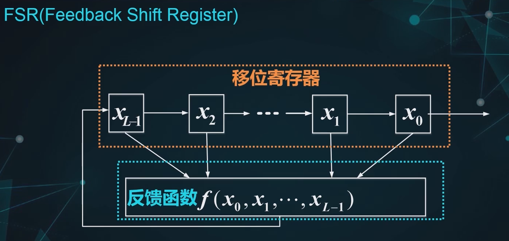
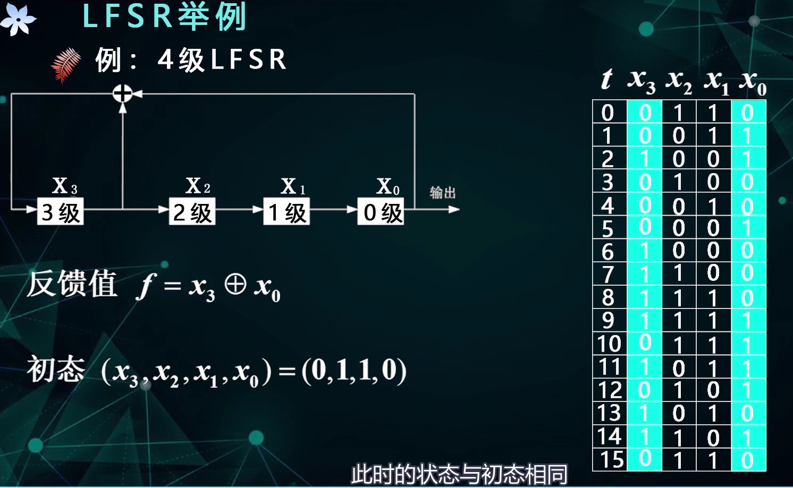

# 序列密码

## 概述

### 1 从密码学分支的角度

> 序列密码也称为流密码

### 2 源于一次一密

- 真随机序列的最大特点就是几乎不可能重复产生
- 折中使用**伪随机序列**，就是序列密码

### 3 实用序列密码系统模型

### 4 分组密码与序列密码的对比

==序列密码的安全性完全取决于密钥流的生成方式==

### 5 序列密码分类

> 按照密钥流生成是否与**明密文**有关

举例理解两类序列密码的特性：

- 同步序列密码的**位置敏感性**

  

- 自同步：可以<u>**自动重建**一些正确的解密过程</u>

  

  

  > 密文的每一位都只和密钥的每一位有关

## 密钥流生成器

### 1 密钥流生成方法的设计思想

### 2 反馈移位寄存器基础知识

#### 2.1 移位寄存器

> 举例说明：
>
> 
>
> 反馈值就是反馈函数的函数值

#### 2.2 反馈函数

- 反馈函数是**状态的函数**

> 举例：
>
> 

## 3 线性反馈移位寄存器

#### 3.1 LFSR概述

举例：

#### 3.2 LFSR的表示

#### 3.3 LFSR举例

举例：

所以，==在LFSR中，全0态具有自循环的特点==

> 这个例子中，周期已经达到了最大

==状态的周期与序列的周期是相同的==

#### 3.4 LFSR的周期

LFSR的状态周期小于等于$2^L-1$

> 减1是排队的全0态

#### 3.5 m序列

> 啥是本原多项式？？？

## A5算法

### 0 算法概述

### 1 算法原理

#### 1.1 整体架构

额外引出的3个bit是**钟控函数的输入**，记为xyz

#### 1.2 钟控方式

- “动”指的是寄存器会被驱动执行**移位反馈**
- 择多原则指的是**多的“动”**

#### 1.3 算法流程

### 2 算法实现

