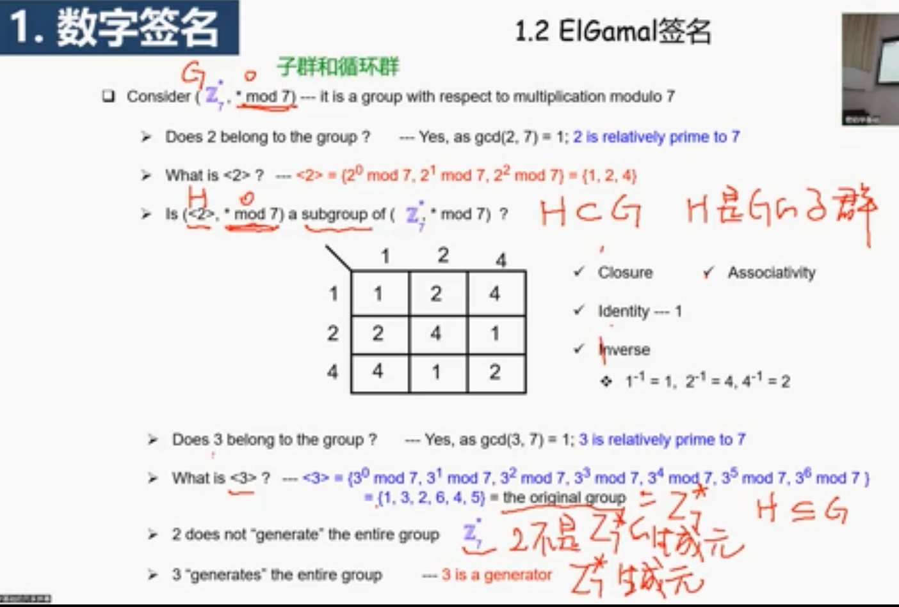

# 数字签名和公钥基础设施

## DS

### 数字签名概述

>   可以同时实现消息完整性、来源真实性和**不可抵赖性**

-   ==数字签名与消息认证的一大区别就在于数字签名可以实现**不可否认性**==

    >   本质是**非对称性**

-   签名的过程

    -   密钥生成：`Gen(.)`
        -   `.`代表安全参数长度
    -   签名：`Sign(m, sk) -> sigma`
    -   验证：`Verf(m, sigma, pk) -> 1/0`

    >   与加密相比，公钥与私钥的使用是相反的

---

-   加上哈希后（密码学原语组合）
    -   如果签名算法是定长的，就可以扩大其适用范围
    -   安全性也会提高
    -   性能也会提高

### 签名算法

#### RSA签名

-   注意，大多数公钥加密算法并不能直接转换成数字签名算法
    -   ElGamal就不行
-   RSA特殊在加密和解密的一致性，所以还可以用作数字签名
    -   本质是因为e和d互逆，可以互相替换
    -   所以这里验证的其实是“解密”出来的东西是否和原消息相等。一定要注意，**签名算法输出一定是0/1**，而不是明文

-   RSA要先解密再判断是否相等，而且解密还是用公钥解密的，所以解密的这个可以伪造

    -   当然，这个消息签名是随机的，就是想发送和消息x是随机的，实际生活中很可能没用，这叫**存在性攻击**

-   缺点2是由于乘法同态性

    >   55:28补充了隐私计算相关拓展

-   加一个Hash可以把这些缺陷改掉，所以先进行hash运算很重要

---

#### ElGamal

-   子群的概念、平凡子群

-   群元素的阶

-   子群生成：生成元、循环群

    >   ElGamal会基于这样的子群

>   举例：
>
>   
>
>   所以$Z_7^*$是循环群

---

-   密钥生成
    -   x和y都在循环群中
-   签名
    -   其中含有概率性
-   验证
    -   代进去算一下就好了

#### Schnorr签名

#### DSS

## PKI

### 1 PKI、CA

$PK_A$与$A$绑定起来

重要角色：CA

-   星型结构，都来找CA帮忙认证
-   圈1肯定不是公开信道发送的
-   CA的PKc是可以安全得到的

### 2 IDB、PKG

-   ID和PK不用绑了，直接相等行不
-   这需要PKG完全可信，因为私钥ta都知道

