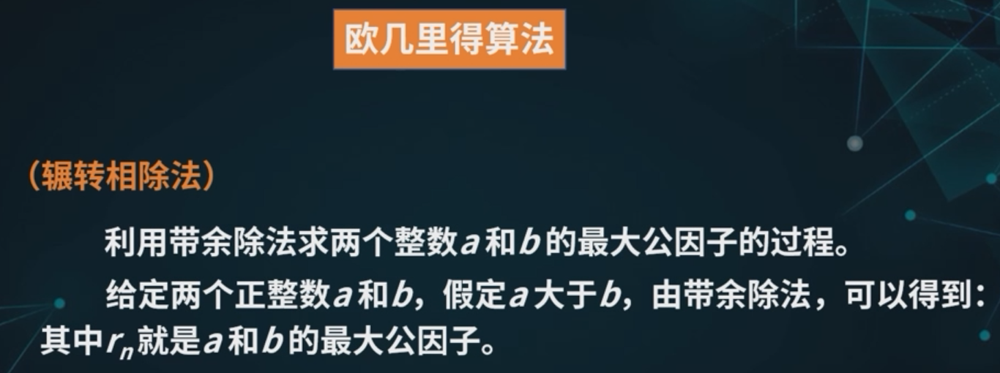
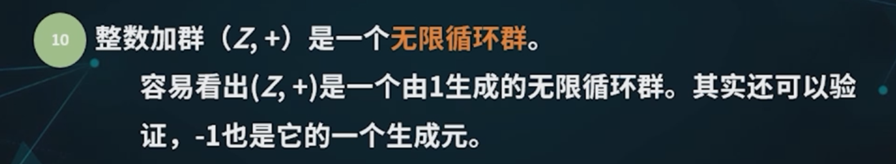

# 数学基础

## 1 数论基础

### 1.1 常见数集

### 1.2 整除性理论

#### 1.2.1 整除

> 

#### 1.2.2 最大公因子

#### 1.2.3 带余除法

利用**带余除法**求两个数的**最大公因子**：欧几里得算法/辗转相除法

- 每次用**上一个式子的除数除以余数**，得到新的式子

- **最后一个式子的除数**/倒数第二个式子的余数就是最大公因子

  > 一定可以到最后余数为0

- 这个推导依据的是辗转相除法得到的一系列等式

### 1.3 素数理论

#### 1.3.1 素数的定义

> 筛法就是xv6-lab里做的管道筛选输出素数

#### 1.3.2 算术基本定理

推论：

### 1.4 同余理论

#### 1.4.1 同余的概念

#### 1.4.2 同余的性质

根据同余关系可以将整数集分解为不相交的子集的并（等价关系）：

这m个子集合为整数模m的同余类/剩余类：

> $\bar k$往往可以由等价类中的最小非负数代替

#### 1.4.3 完全剩余系

### 1.5 欧拉函数

如果整数模n的其中一个剩余类的数都与n互素，称这个**剩余类与n互素**

从与m互素的剩余类中各取一个数组成的集合称为**整数模m的简化剩余系**

> 

欧拉定理：

费马小定理（欧拉定理的特例）：

## 2 群论基础

> 

### 2.1 群的定义

#### 2.1.1 群

#### 2.1.2 Abel群

- 乘法称为**加法**，群称为**加群**
- 单位元称为**零元**，记作**0**
- 逆元称为**负元**，写成**-a**

> 

#### 2.1.3 无限群和有限群

> 典型的有限群：
>
> 
>
> > n次单位根：$x^n=1$
>
> 

### 2.2 群元素的性质

#### 2.2.1 群元素的阶

> 
>
> 
>
> 

#### 2.2.2 阶的定理

> 重要推论：设a是群G的元素，如果a的阶等于n，那么a的k次方的阶为n 当且仅当 (k, n)=1

### 2.3 循环群

#### 2.3.1 循环群的定义

> 
>
> 
>
> 这两个例子就是循环群的典型代表

可以看出，对于循环群来说，**生成元**是核心

#### 2.3.2 循环群的生成元

> 

### 2.4 子群

#### 2.4.1 子群的定义

#### 2.4.2 子群的陪集

> 

重要性质：

#### 2.4.3 拉格朗日定理

> 
>
> 
>
> 

重要推论：

## 3 环论基础

> 

### 3.1 环的定义

#### 3.1.1 环

#### 3.1.2 可换环和不可换环

> 
>
> > 
>
> 
>
> > 

#### 3.1.3 有限环和无限环

#### 3.1.4 含幺环

> 

### 3.2 环的零因子

重点：零因子一定不是可逆元，也就是说，**<u>所有可逆元都不是零因子</u>**

> 
>
> 

### 3.3 三类特殊的环

#### 3.3.1 整环

> 

#### 3.3.2 除环、域

> 整环：单位元、无零因子、交换
>
> 除环：单位元、逆元（能推出无零因子）、元素个数大于1
>
> 

### 3.4 剩余类环

理解剩余类环中的元素时，重点看其**完全剩余系**即可

> 重要结论：
>
> 

> 这个有限域很重要

> 
>
> 

