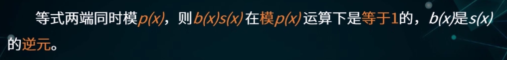

# 数学基础

## 1 数论基础

### 1.1 常见数集

### 1.2 整除性理论

#### 1.2.1 整除

> 

#### 1.2.2 最大公因子

#### 1.2.3 带余除法

利用**带余除法**求两个数的**最大公因子**：欧几里得算法/辗转相除法

- 每次用**上一个式子的除数除以余数**，得到新的式子

- **最后一个式子的除数**/倒数第二个式子的余数就是最大公因子

  > 一定可以到最后余数为0

- 这个推导依据的是辗转相除法得到的一系列等式

> :star:
>
> 欧几里德算法是求两个数的最大公因子，扩展的欧几里德算法是想用两个数的组合表示他们的最大公因子

### 1.3 素数理论

#### 1.3.1 素数的定义

> 筛法就是xv6-lab里做的管道筛选输出素数

#### 1.3.2 算术基本定理

推论：

### 1.4 同余理论

#### 1.4.1 同余的概念

#### 1.4.2 同余的性质

根据同余关系可以将整数集分解为不相交的子集的并（等价关系）：

这m个子集合为整数模m的同余类/剩余类：

> $\bar k$往往可以由等价类中的最小非负数代替

#### 1.4.3 完全剩余系

### 1.5 欧拉函数

如果整数模n的其中一个剩余类的数都与n互素，称这个**剩余类与n互素**

从与m互素的剩余类中各取一个数组成的集合称为**整数模m的简化剩余系**

> 

欧拉定理：

费马小定理（欧拉定理的特例）：

## 2 群论基础

> 

### 2.1 群的定义

#### 2.1.1 群

#### 2.1.2 Abel群

- 乘法称为**加法**，群称为**加群**
- 单位元称为**零元**，记作**0**
- 逆元称为**负元**，写成**-a**

> 

#### 2.1.3 无限群和有限群

> 典型的有限群：
>
> 
>
> > n次单位根：$x^n=1$
>
> 

### 2.2 群元素的性质

#### 2.2.1 群元素的阶

> 
>
> 
>
> 

#### 2.2.2 阶的定理

> 重要推论：设a是群G的元素，如果a的阶等于n，那么a的k次方的阶为n 当且仅当 (k, n)=1

### 2.3 循环群

#### 2.3.1 循环群的定义

> 
>
> 
>
> 这两个例子就是循环群的典型代表

可以看出，对于循环群来说，**生成元**是核心

#### 2.3.2 循环群的生成元

> 

### 2.4 子群

#### 2.4.1 子群的定义

#### 2.4.2 子群的陪集

> 

重要性质：

#### 2.4.3 拉格朗日定理

> 
>
> 
>
> 

重要推论：

## 3 环论基础

> 

### 3.1 环的定义

#### 3.1.1 环

#### 3.1.2 可换环和不可换环

> 
>
> > 
>
> 
>
> > 

#### 3.1.3 有限环和无限环

#### 3.1.4 含幺环

> 

### 3.2 环的零因子

重点：零因子一定不是可逆元，也就是说，**<u>所有可逆元都不是零因子</u>**

> 
>
> 

### 3.3 三类特殊的环

#### 3.3.1 整环

> 

#### 3.3.2 除环、域

> 整环：单位元、无零因子、交换
>
> 除环：单位元、逆元（能推出无零因子）、元素个数大于1
>
> 

### 3.4 剩余类环

理解剩余类环中的元素时，重点看其**完全剩余系**即可

> 重要结论：
>
> 

> 这个有限域很重要

> 
>
> 

## 4 有限域

本讲主要是**有限域的基本结构和构造方法**

### 4.1 简单的有限域

我们还需要寻找更多类型的有限域

包含q个元素的有限域：

> $Z_4$不是有限域，4是一个合数，$Z_4$包含零因子

有限域的两大类：

- $Z_p$
- 利用多项式构造

### 4.2 多项式的简单知识

#### 4.2.1 多项式的定义

> 这是一种形式表达式，未定元x和数域F一般没有关系

#### 4.2.2 多项式的整除性理论

整除：

带余除法：

最大公因式：

多项式的欧几里得算法：

互素：

素多项式：

- 如果数域F上的多项式p(x)只能被$\alpha$或者$\alpha$p(x)整除（$\alpha$是数域F中的非零元），称p(x)为**不可约多项式**，否则称为**可约多项式**
- 次数至少为1的**首一不可约多项式**称为**素多项式**
- 不可约多项式的本质是不能分解为两个次数较低的多项式的乘积

> 

多项式的唯一因式分解定理：

### 4.3 利用多项式构造有限域

这个环成为域的充分必要条件是：

> 
>
> 
>
> 

域的扩张：

- 对于已知的任何有限域GF(q)，只要能找到GF(q)上的一个m次素多项式就一定能构造出一个新的有限域，由GF(q)上次数小于m的全体多项式组成
- 这个新的有限域包含了$q^m$个元素，即$GF(q^m)$
- 这种构造有限域的方法称为**域的扩张**

> 

### 4.4 有限域元素的表示形式

关于指数形式的思考：

> 
>
> 

有限域的两种群结构：

- 全体元素对于域的加法构成一个可换群
- 全体非零元素对于域的乘法也构成一个可换群

生成元即本原元：

> 
>
> 

其他常用结论：

- 任意有限域上存在任意次数的素多项式。所以可以构造出任意素数p的任意m次方的有限域，所有的有限域从抽象的角度看都具有这种形式

### 4.5 有限域上的离散对数问题

### 4.6 补充：有限域上的运算

# 数学基础(hitsz)

# 9.14雨课堂

## 整除性和带余除法

-   整除、因子的概念
-   商和余数的表示法

## 素数和模运算

-   素数的**整数分解唯一性**

---

-   同余的概念与表示方法
-   a和0模n同余则n整除a

---

-   同余的自反性
-   同余的传递性

---

-   模运算的分配律

>   举例：
>
>   

---

# 9.26

## 欧几里得算法和扩展欧几里得算法

## 费马小定理和欧拉定理

## 素性检测

## 中国剩余定理

## 离散对数

