## 4 有限域

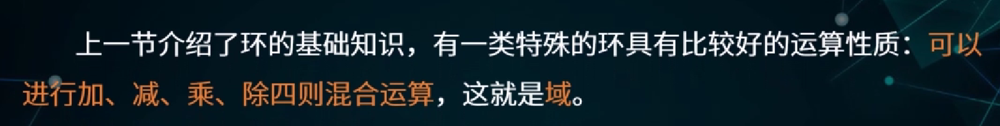

本讲主要是**有限域的基本结构和构造方法**

### 4.1 简单的有限域

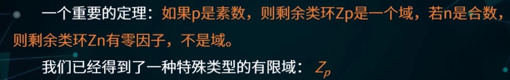

我们还需要寻找更多类型的有限域

包含q个元素的有限域：

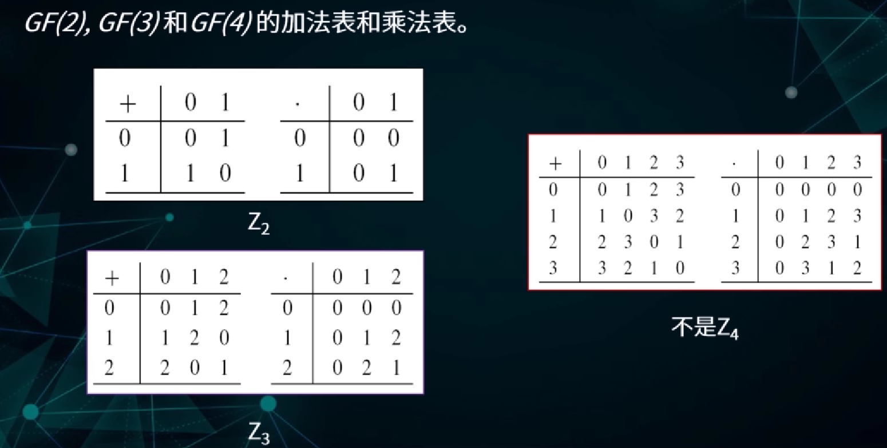

> $Z_4$不是有限域，4是一个合数，$Z_4$包含零因子

有限域的两大类：

- $Z_p$
- 利用多项式构造

### 4.2 多项式的简单知识

#### 4.2.1 多项式的定义

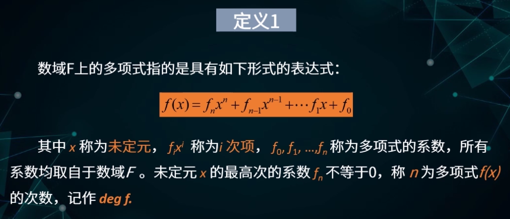

> 这是一种形式表达式，未定元x和数域F一般没有关系

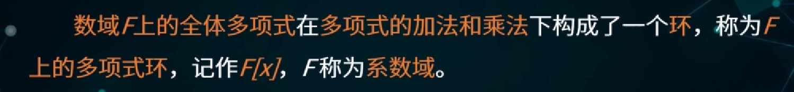

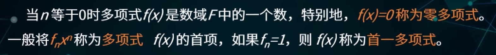

#### 4.2.2 多项式的整除性理论

整除：

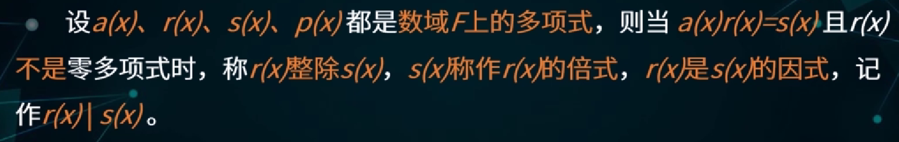

带余除法：

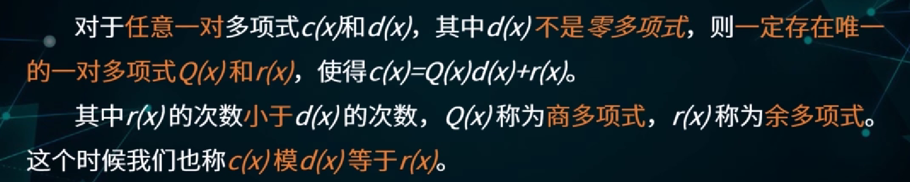

最大公因式：

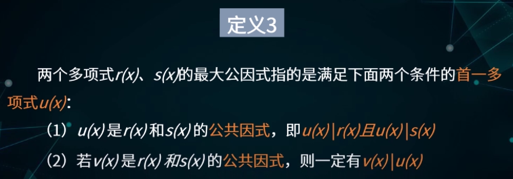

多项式的欧几里得算法：

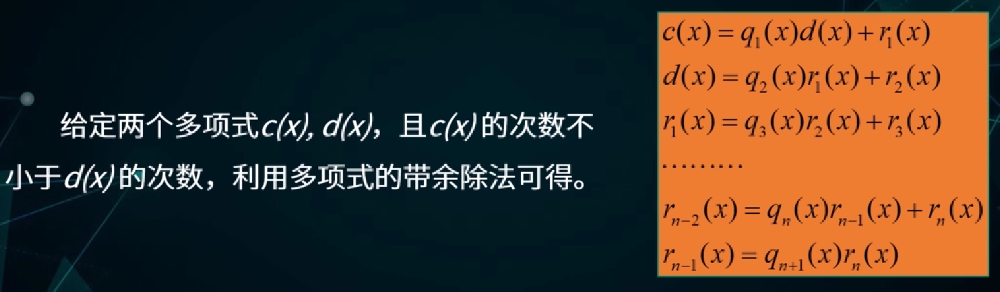

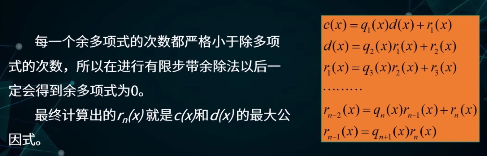

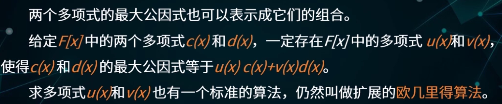

互素：

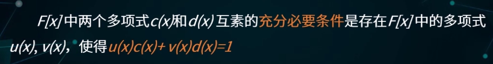

素多项式：

- 如果数域F上的多项式p(x)只能被$\alpha$或者$\alpha$p(x)整除（$\alpha$是数域F中的非零元），称p(x)为**不可约多项式**，否则称为**可约多项式**
- 次数至少为1的首一不可约多项式称为**素多项式**
- 不可约多项式的本质是不能分解为两个次数较低的多项式的乘积

> 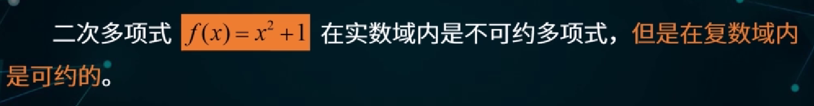

多项式的唯一因式分解定理：

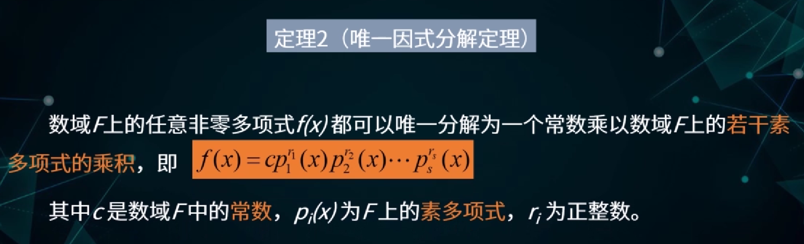

### 4.3 利用多项式构造有限域

这个环成为域的充分必要条件是：

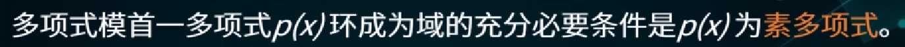

> 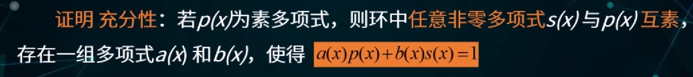
>
> 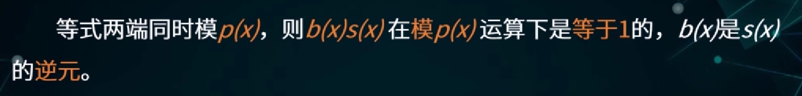
>
> 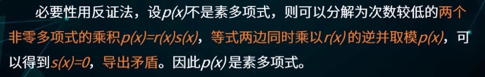

域的扩张：

- 对于已知的任何有限域GF(q)，只要能找到GF(q)上的一个m次素多项式就一定能构造出一个新的有限域，由GF(q)上次数小于m的全体多项式组成
- 这个新的有限域包含了$q^m$个元素，即$GF(q^m)$
- 这种构造有限域的方法称为**域的扩张**

> 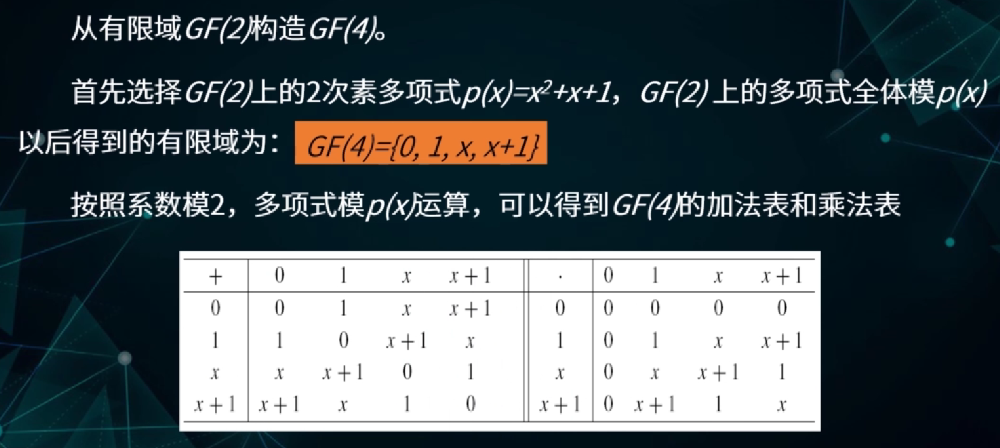

### 4.4 有限域元素的表示形式

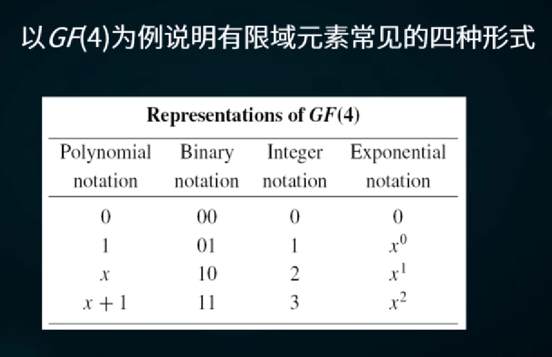

关于指数形式的思考：

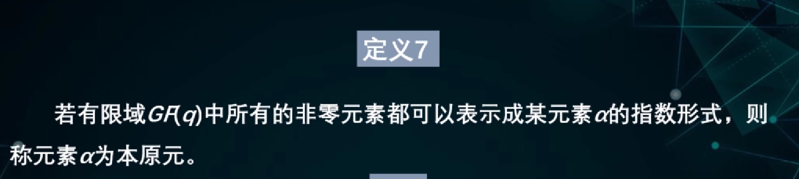

> 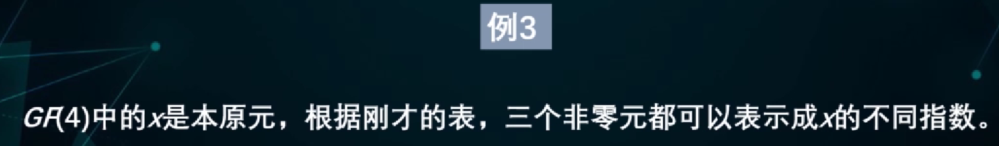
>
> 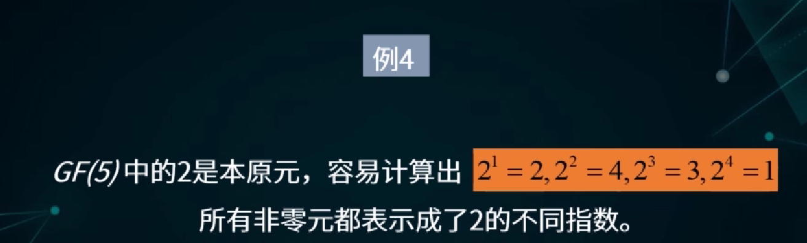

有限域的两种群结构：

- 全体元素对于域的加法构成一个可换群
- 全体非零元素对于域的乘法也构成一个可换群

生成元即本原元：

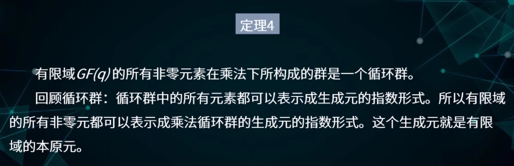

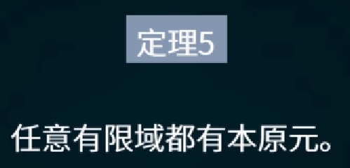

> 
>
> 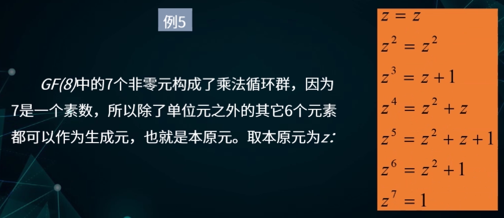

其他常用结论：

- 任意有限域上存在任意次数的素多项式。所以可以构造出任意素数p的任意m次方的有限域，所有的有限域从抽象的角度看都具有这种形式

### 4.5 有限域上的离散对数问题

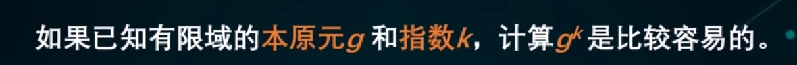

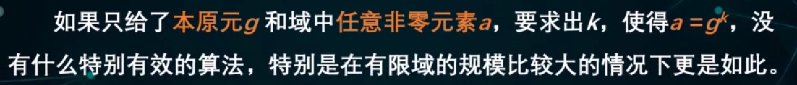

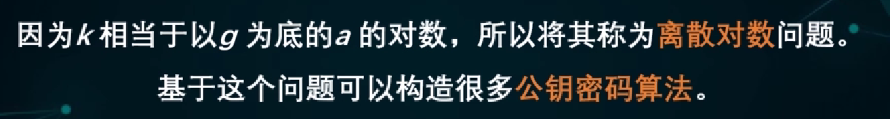

