# 绪论

## 1 密码学的概念和发展简史

### 1.1 概念

以**加密、解密**为核心的信息安全技术

> 加密就是将容易看懂的明文变成不容易看懂的密文

### 1.2 发展简史

### 1.2.1 古典密码

> 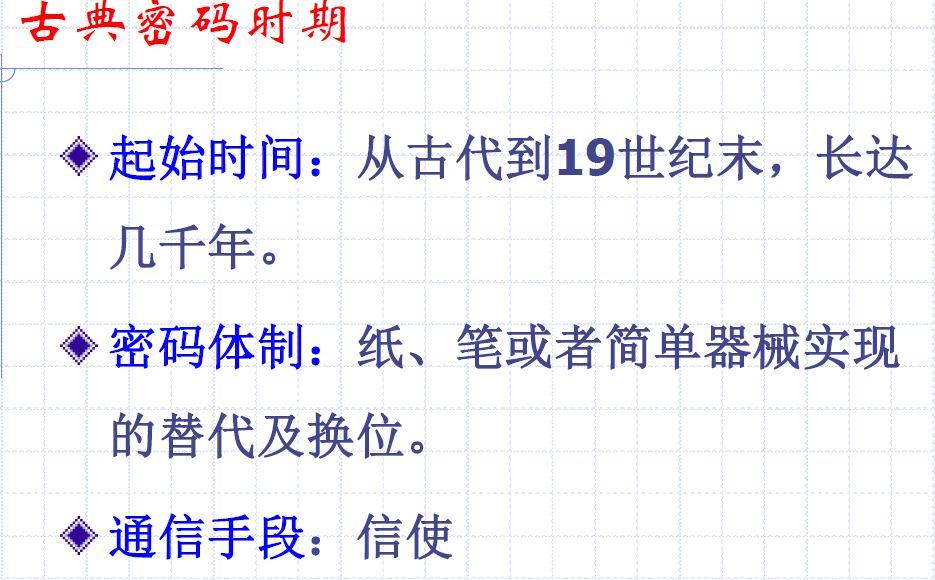

- 斯巴达密码棒

  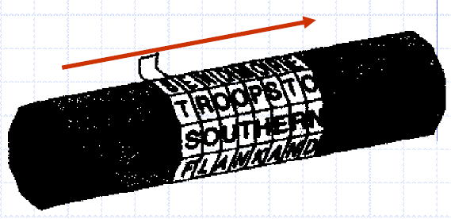

- 凯撒密码

  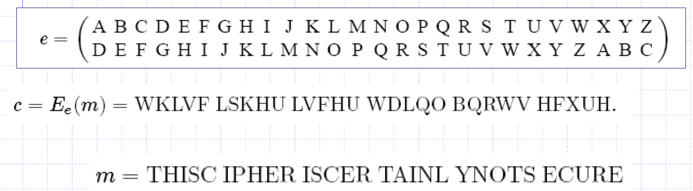

  - e：密钥
  - E：加密过程

  > 在凯撒密码的基础上发展出了单表、多表代换密码

### 1.2.2 近代密码

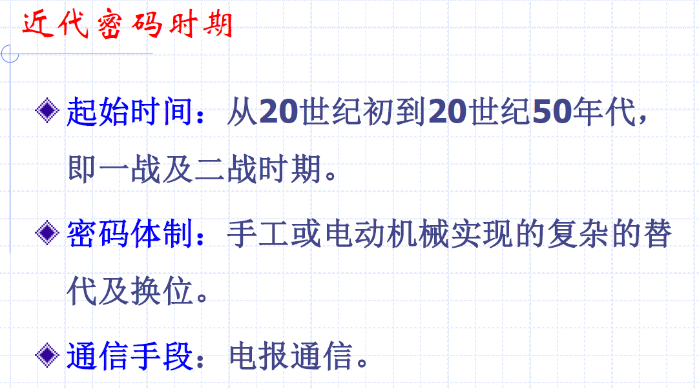

### 1.2.3 现代密码

> 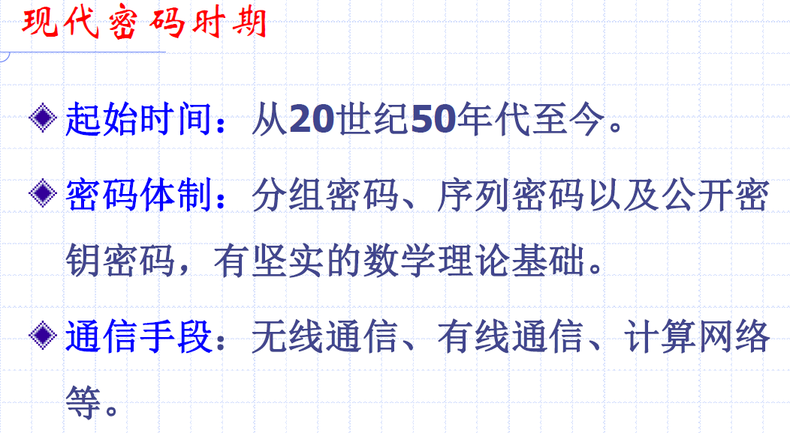

三件大事：

- ***Shannon***创立信息论，发表文章《保密系统的通信理论》，标志着密码学的建立和现代密码技术研究的开始（第一次飞跃）
- 美国国家标准局NBS公布实施美国**数据加密标准*DES***（Data Encryption Standard） ，密码学史上第一次公开加密算法，并广泛应用于商用数据加密
- **公钥密码**出现，打破**单钥密码**统治的局面（第二次飞跃）

## 2 古典密码-单表代换密码

> 古典密码可分为**代换密码**和**置换密码**两大类

### 2.1 移位密码

- 移位密码的加密对象为英文字母，移位密码采用对明文消息的每一个英文字母向前推移固定位的方式实现加密。换句话说，移位密码实现了26个英文字母的循环移位。
- 移位密码中，当取密钥k=3时，就得到凯撒密码

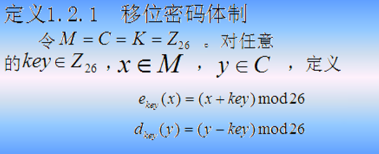

移位密码的安全性完全依赖于**密钥的保密性**

### 2.2 仿射密码

仿射密码是移位密码的一个推广，其加密过程中不仅包含移位操作，而且使用了乘法运算。

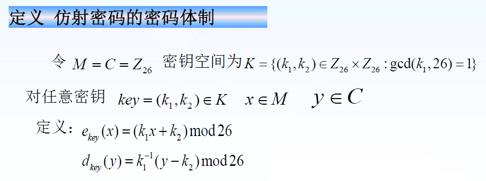

密文与明文的对应关系很明显，为了将其复杂化，我们可以使用**代换密码**

### 2.3 代换密码

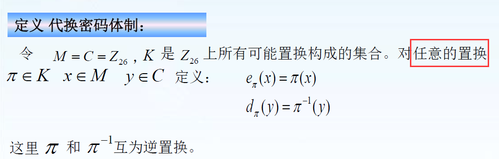

密钥就是**置换**

> 置换是集合论中的一个概念（**集合到其自身的双射**），Z26上的置换数有$26!$个（双射的个数）

> 移位密码和仿射密码只用到了有限种置换，而代换密码可以用任意置换

往往使用一张表描述置换，所以称为**单表代换密码**

### 2.4 单表代换密码的破译

基于频率分析的统计攻击

> 能这样攻击本质是因为置换是双射，字母间**一一对应**的

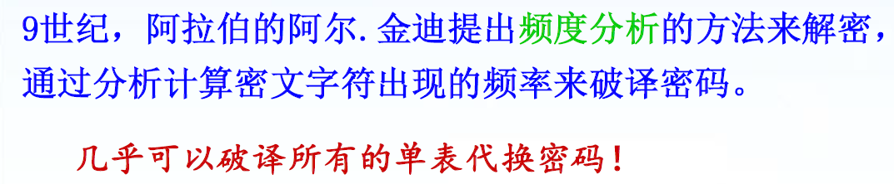

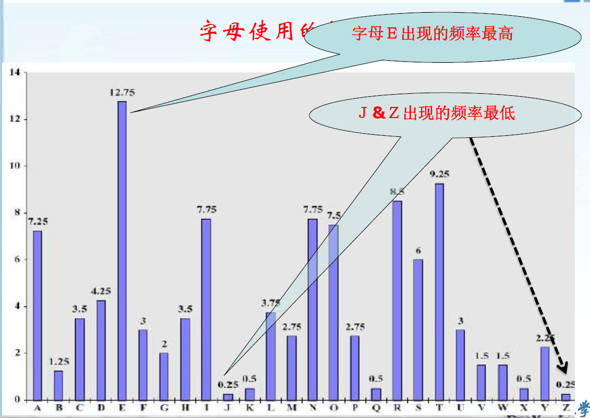

在文本量大时，这种方法准确率很高

## 3 古典密码-多表代换密码

维吉尼亚密码

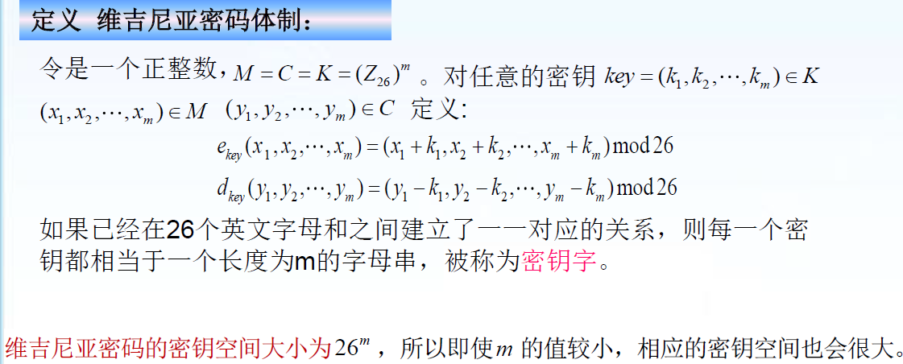

> k是密钥，x是明文。如果x的长度大于k，则必须是其倍数；
>
> $26^m$就是单射的个数

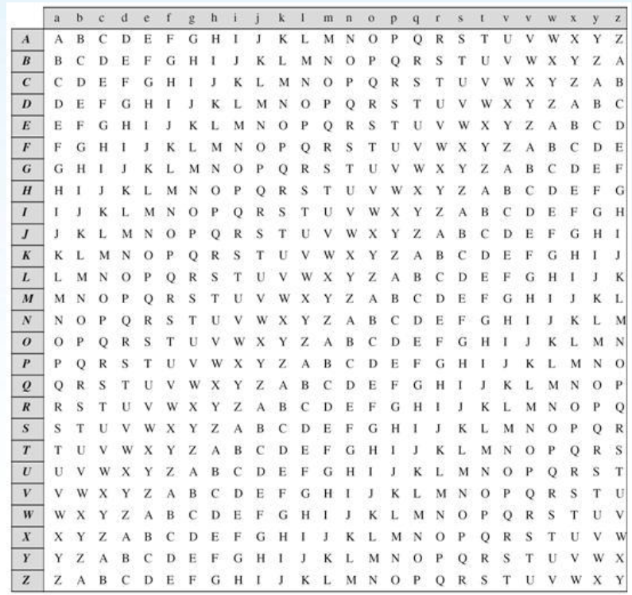

- 明文为列，密文为行

> 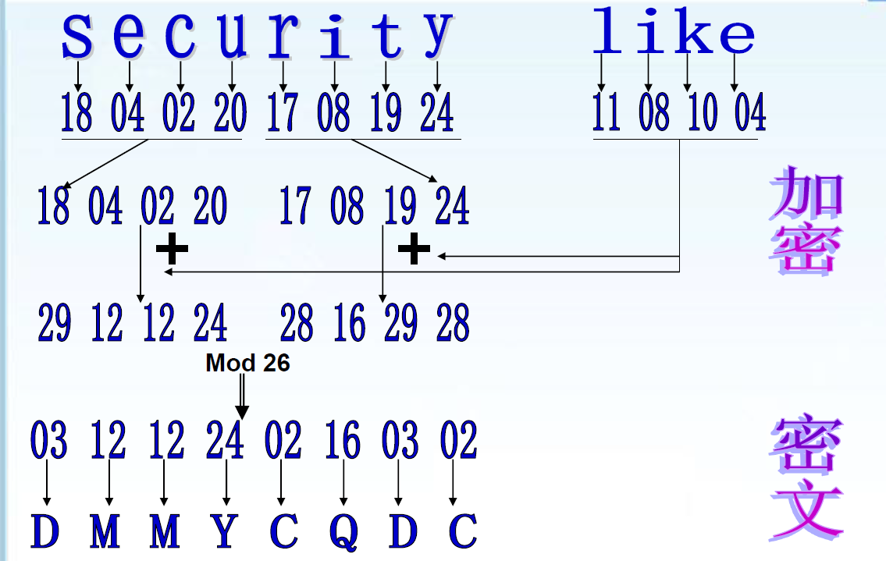

字母间不是一一对应的，无法通过频率分析破译（变成了单射）

> 古典密码-置换密码：
>
> 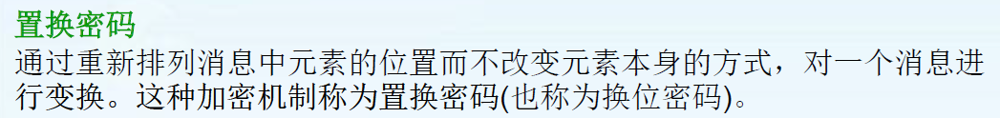
>
> 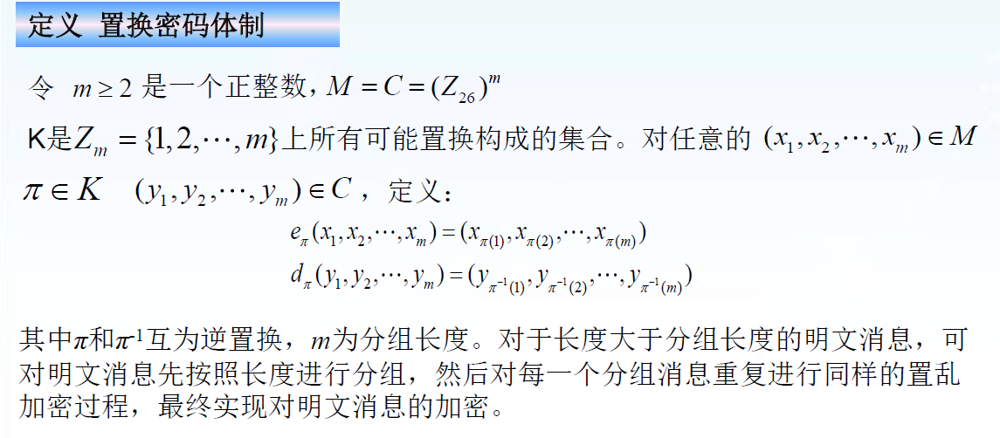
>
> 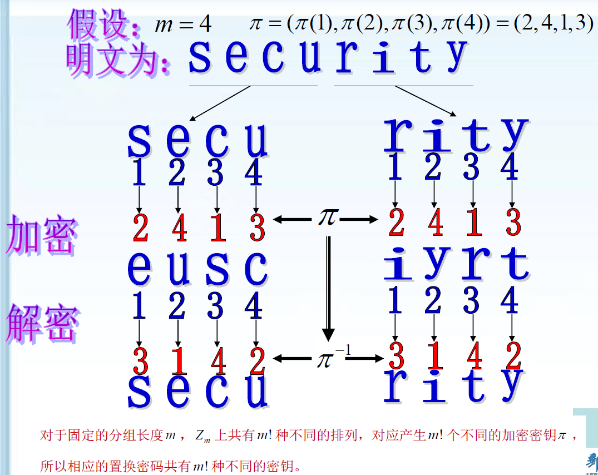
>
> 如果置换的“长度”太小的话，也是会成倍扩展（分组）
>
> 只有在明文分组比较长的时候才有安全性和实用性

## 4 密码体制

#### 4.1 加密算法的基本框架

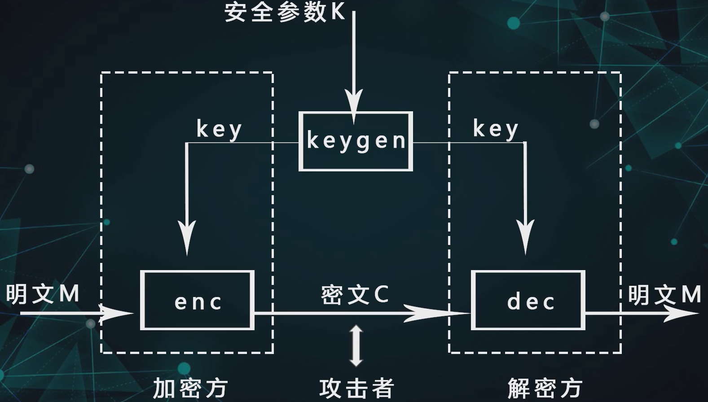

- 用密钥解密叫“合法解密”
- 用攻击手段解密叫“非法解密”

### 4.2 加密模型

$<M,C,K,E,D>$

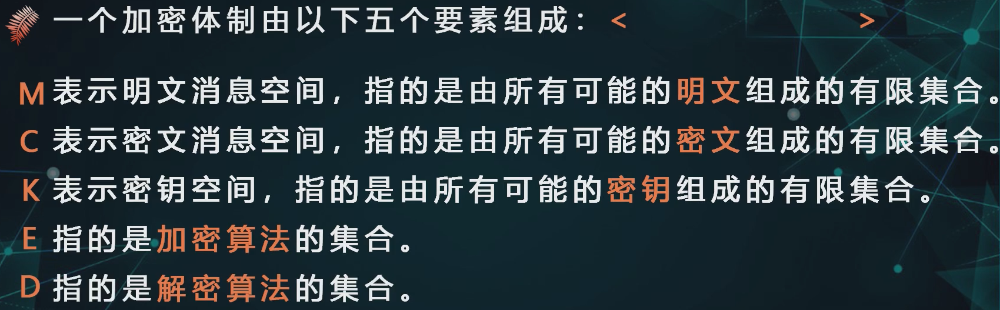

> 之前讲过的加密算法，M和C都是Z26，但K有所不同：
>
> 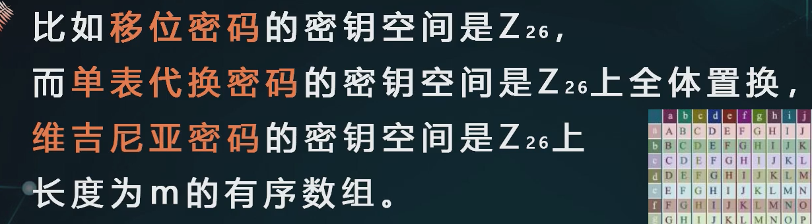
>
> 显然密钥空间越大越好

### 4.3 攻击者模型

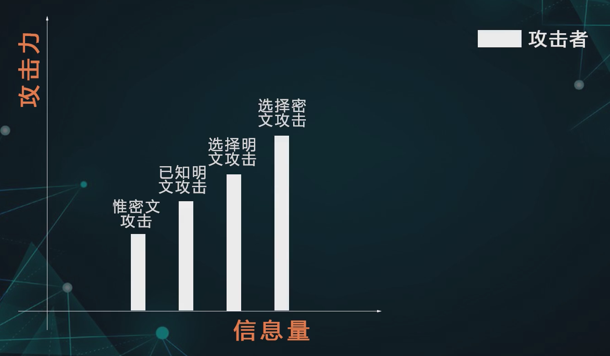

- 已知明文就是知道**一些明文-密文对**，所以移位密码不能抵抗已知明文攻击
- 选择明文的意思就是攻击者可以得到**加密服务**，攻击者选择一个明文就能得到密文。所有古典密码都无法抵抗选择明文攻击。
- 选择明文的意思就是攻击者可以得到一定程度的**解密服务**，唯一的限制是不能得到要解密的密文的明文

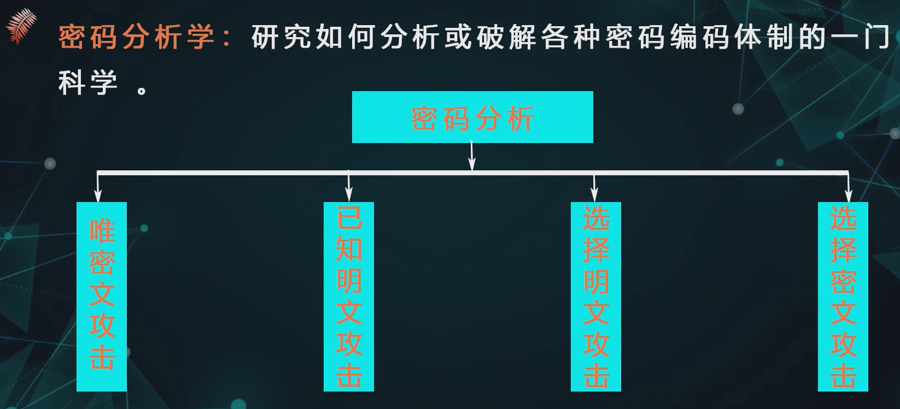

现代加密技术主要面对后两种攻击。

但攻击者的能力还可以更强，比如适应性选择密文攻击。

